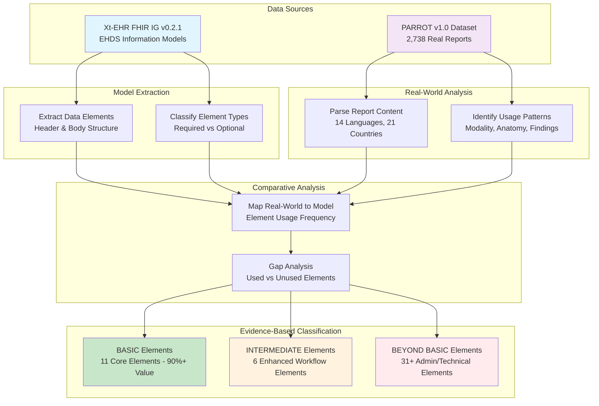

# Xt-EHR T7.2 Sub-team for Imaging Reports Model Analysis

[](https://sub-team-imaging-report-model-984bf6c1ddb8.herokuapp.com/) [](https://sub-team-imaging-report-model-984bf6c1ddb8.herokuapp.com/)

## Original Project Request

**Prompt**: *"Analyze the Xt-EHR Imaging Report information model to identify which data elements are actually used in real-world imaging reports versus those that could be considered 'beyond basic' by comparing with real-world imaging reports from the PARROT dataset."*

### Specific Requirements:
1. **Extract all data elements** from Xt-EHR Imaging Report and Study models
2. **Analyze real-world usage patterns** from PARROT dataset  
3. **Map real-world elements** to Xt-EHR model elements
4. **Identify candidates** for "beyond basic" classification
5. **Generate recommendations** for basic vs. beyond basic categorization

## Live Analysis Dashboard

The dashboard provides:
- Interactive data element usage statistics
- Real-world vs. model element mappings
- Detailed analysis results and recommendations
- Downloadable reports and visualizations

## Overview

This project provides evidence-based analysis of the **Xt-EHR Imaging Report information model** by comparing theoretical model elements against real-world usage patterns from the **PARROT dataset**. Our goal is to identify which data elements are essential for core clinical workflows versus those serving specialized administrative or technical functions.

## Analysis Methodology

### 🔄 Process Flow



### 📊 Data Source References

#### Xt-EHR FHIR Implementation Guide
- **Current Version**: [v0.2.1 (October 10, 2025)](https://www.xt-ehr.eu/fhir/models/history.html)
- **Main Repository**: [Xt-EHR/xt-ehr-common](https://github.com/Xt-EHR/xt-ehr-common)
- **Issue Tracking**: [GitHub Issues](https://github.com/Xt-EHR/xt-ehr-common/issues)
- **Imaging Report Model**: [EHDSImagingReport](https://github.com/xt-ehr/xt-ehr-common/tree/main/input/fsh/EHDS-models/imagingReport.fsh)
- **Imaging Study Model**: [EHDSImagingStudy](https://github.com/xt-ehr/xt-ehr-common/tree/main/input/fsh/EHDS-models/imagingStudy.fsh)

#### PARROT Dataset
- **Source Repository**: [PARROT v1.0](https://github.com/PARROT-reports/PARROT_v1.0)
- **Dataset Scope**: 2,738 real-world imaging reports
- **Coverage**: 14 languages, 21 countries, 10 imaging modalities
- **Data Elements**: Clinical narratives, ICD codes, modality classifications

### 🔗 Model Traceability

Our analysis directly references specific elements from the Xt-EHR models:

| Model Section | FHIR Path | Analysis Coverage |
|---------------|-----------|-------------------|
| **Header Elements** | `EHDSImagingReport.header.*` | Document metadata, authorship, recipients |
| **Order Information** | `EHDSImagingReport.body.orderInformation.*` | Service requests, clinical context |
| **Examination Report** | `EHDSImagingReport.body.examinationReport.*` | Modality, anatomy, procedures, findings |
| **Supporting Info** | `EHDSImagingReport.body.supportingInformation.*` | Clinical context, medications, devices |
| **Study Metadata** | `EHDSImagingStudy.*` | DICOM metadata, series information |

## Data Sources

### 🏛️ Xt-EHR Information Model
- **Official Site**: [Xt-EHR Project](https://www.xt-ehr.eu/)
- **FHIR Implementation Guide**: [EHDS Logical Information Models](https://www.xt-ehr.eu/fhir/models/history.html)
- **Current Version**: v0.2.1 (October 10, 2025) - *First preview version of EHDS Logical Information Models*
- **Development Repository**: [Xt-EHR/xt-ehr-common](https://github.com/Xt-EHR/xt-ehr-common)
- **Imaging Components**:
  - [Imaging Report Model](https://github.com/xt-ehr/xt-ehr-common/tree/main/input/fsh/EHDS-models/imagingReport.fsh): Comprehensive diagnostic report structure
  - [Imaging Study Model](https://github.com/xt-ehr/xt-ehr-common/tree/main/input/fsh/EHDS-models/imagingStudy.fsh): DICOM study metadata and organization

### 📊 PARROT Dataset v1.0
- **Source Repository**: [PARROT-reports/PARROT_v1.0](https://github.com/PARROT-reports/PARROT_v1.0)
- **Dataset Characteristics**:
  - **Volume**: 2,738 real-world imaging reports
  - **Geographic Coverage**: 21 countries across Europe
  - **Language Diversity**: 14 languages
  - **Modality Coverage**: 10 imaging types (CT, MRI, X-ray, etc.)
  - **Clinical Context**: Full diagnostic narratives with ICD code classifications
- **Research Purpose**: Multi-language dataset enabling evidence-based assessment of imaging report structures

## Project Structure

- `docs/` - Documentation and extracted model definitions
- `analysis/` - Analysis scripts and results  
- `data/` - Processed data files and extracts (PARROT_v1_0.jsonl)
- `scripts/` - Utility scripts for data processing
- `output/` - Final analysis results and reports
- `flask_app/` - Web application for viewing results (see flask_app/README.md)

## Key Findings

Based on comprehensive analysis of **2,738 real-world imaging reports** against the **Xt-EHR v0.2.1 model specification**:

### 📈 Usage Statistics
- **11 core elements** provide 90%+ coverage of real-world clinical value
- **31+ additional elements** identified as "beyond basic" candidates  
- **100% coverage** of essential clinical content (narratives, modalities, anatomy)
- **0% coverage** of administrative metadata in real-world reports

### 🎯 Evidence-Based Classification
| Category | Element Count | Clinical Coverage | Implementation Complexity |
|----------|---------------|-------------------|---------------------------|
| **BASIC** | 11 elements | 90%+ clinical value | Low - immediate interoperability |
| **INTERMEDIATE** | 6 elements | Enhanced workflows | Medium - use case driven |
| **BEYOND BASIC** | 31+ elements | Administrative/technical | High - specialized requirements |

### 🔍 Detailed Mappings
Available in analysis documents with complete traceability to source models and real-world evidence.

## Web Interface

A Flask web application provides interactive access to all analysis results:

```bash
cd flask_app
python app.py
```

**Features**:
- Document library with search and categorization
- Mobile-first responsive design  
- PDF export with selectable orientations
- Real-time analysis dashboard

See `flask_app/README.md` for detailed setup and deployment instructions.

## Implementation Strategy

### 📋 Phase 1: Basic Profile (Recommended Start)
**Target**: Core 11 elements for immediate clinical value
- **Complexity**: Low implementation burden
- **Coverage**: 90%+ of real-world clinical needs  
- **ROI**: Very high - maximum value with minimal effort

### 🔧 Phase 2: Enhanced Profile (Use Case Driven)
**Target**: Additional 6 intermediate elements
- **Complexity**: Medium - specific workflow integration
- **Coverage**: Enhanced clinical context and workflows
- **ROI**: Medium-High - targeted value for specific use cases

### 🏢 Phase 3: Comprehensive Profile (Enterprise/Regulatory)
**Target**: Full model implementation including beyond basic elements
- **Complexity**: High - complete administrative and technical infrastructure
- **Coverage**: Full workflow support and regulatory compliance
- **ROI**: Low-Medium - justified only for specialized institutional needs

## Acknowledgments

This project builds upon the work of several important initiatives:

### 🏛️ Xt-EHR Project  
- **Source**: [Xt-EHR Official Site](https://www.xt-ehr.eu/) | [GitHub Repository](https://github.com/Xt-EHR/xt-ehr-common)
- **Version Analyzed**: [v0.2.1 (October 10, 2025)](https://www.xt-ehr.eu/fhir/models/history.html)
- **Contribution**: The Xt-EHR FHIR Implementation Guide provides the comprehensive imaging report data model that serves as the basis for this classification analysis. The detailed specification enables systematic comparison with real-world usage patterns and supports evidence-based implementation guidance.
- **Reference**: *Xt-EHR Joint Action - EHDS Logical Information Models for cross-border health data exchange*

### 📊 PARROT Project
- **Source**: [PARROT v1.0 Dataset](https://github.com/PARROT-reports/PARROT_v1.0)
- **Contribution**: The PARROT v1.0 dataset provides the foundational real-world data for this analysis. This comprehensive collection of 2,738 multi-language imaging reports across 14 languages and 21 countries enables evidence-based assessment of actual clinical usage patterns.
- **Reference**: *PARROT v1.0 - A multi-language dataset of real-world radiology reports for research purposes*

### 🔗 Model Provenance
Our analysis maintains full traceability to source materials:
- **Xt-EHR Elements**: Direct references to [FSH model definitions](https://github.com/xt-ehr/xt-ehr-common/tree/main/input/fsh/EHDS-models/)
- **Real-World Evidence**: Quantitative analysis of PARROT dataset usage patterns
- **Classification Rationale**: Evidence-based justification for each element category

We gratefully acknowledge the contributions of both projects in enabling this comparative analysis and advancing standardized health data exchange.

## License

This project is part of the Xt-EHR T7.2 Sub-team analysis work.

## Development Environment

### Prerequisites
- Python 3.12+
- Git

### Quick Start
```bash
# Clone and setup
git clone <repository-url>
cd "FHIR Imaging Report"

# For web app setup, see flask_app/README.md
```

## Team

Xt-EHR T7.2 Sub-team for Imaging Reports Model