# Analysis Process Flow and Methodology

## Overview

This document details the methodology used to analyze the Xt-EHR Imaging Report information model against real-world usage patterns from the PARROT dataset.

## Process Flow Diagram

```mermaid
graph TB
    subgraph "📚 Data Sources"
        A["🏛️ Xt-EHR FHIR IG v0.2.1<br/>EHDS Information Models<br/><i>github.com/Xt-EHR/xt-ehr-common</i>"]
        B["📊 PARROT v1.0 Dataset<br/>2,738 Real-World Reports<br/><i>14 Languages, 21 Countries</i>"]
    end
    
    subgraph "🔍 Model Extraction Phase"
        C["📋 Extract Data Elements<br/>Header & Body Structure<br/><i>EHDSImagingReport.fsh</i>"]
        D["🏷️ Classify Element Types<br/>Required vs Optional<br/><i>Cardinality Analysis</i>"]
    end
    
    subgraph "📈 Real-World Analysis Phase"
        E["🌐 Parse Report Content<br/>Multi-language Processing<br/><i>Clinical Narratives</i>"]
        F["🔎 Identify Usage Patterns<br/>Modality, Anatomy, Findings<br/><i>ICD Code Classification</i>"]
    end
    
    subgraph "⚖️ Comparative Analysis Phase"
        G["🔗 Map Real-World to Model<br/>Element Usage Frequency<br/><i>Quantitative Assessment</i>"]
        H["📊 Gap Analysis<br/>Used vs Unused Elements<br/><i>Coverage Statistics</i>"]
    end
    
    subgraph "🎯 Evidence-Based Classification"
        I["✅ BASIC Elements<br/>11 Core Elements<br/><i>90%+ Clinical Value</i>"]
        J["⚡ INTERMEDIATE Elements<br/>6 Enhanced Workflow<br/><i>Targeted Use Cases</i>"]
        K["🔧 BEYOND BASIC Elements<br/>31+ Admin/Technical<br/><i>Specialized Functions</i>"]
    end
    
    subgraph "📋 Implementation Strategy"
        L["📍 Phase 1: Basic Profile<br/>Immediate Clinical Value<br/><i>Low Complexity</i>"]
        M["🔧 Phase 2: Enhanced Profile<br/>Workflow Integration<br/><i>Medium Complexity</i>"]
        N["🏢 Phase 3: Full Profile<br/>Comprehensive Coverage<br/><i>High Complexity</i>"]
    end
    
    A --> C
    A --> D
    B --> E
    B --> F
    C --> G
    D --> G
    E --> G
    F --> G
    G --> H
    H --> I
    H --> J
    H --> K
    I --> L
    J --> M
    K --> N
    
    style A fill:#e1f5fe,stroke:#0277bd,stroke-width:2px
    style B fill:#f3e5f5,stroke:#7b1fa2,stroke-width:2px
    style I fill:#c8e6c9,stroke:#2e7d32,stroke-width:2px
    style J fill:#fff3e0,stroke:#ef6c00,stroke-width:2px
    style K fill:#ffebee,stroke:#c62828,stroke-width:2px
    style L fill:#e8f5e8,stroke:#4caf50,stroke-width:2px
    style M fill:#fff8e1,stroke:#ff9800,stroke-width:2px
    style N fill:#fce4ec,stroke:#e91e63,stroke-width:2px
```



## Detailed Methodology

### 1. Data Source Analysis

#### Xt-EHR Model Extraction
- **Source**: [Xt-EHR/xt-ehr-common v0.2.1](https://github.com/Xt-EHR/xt-ehr-common)
- **Method**: Parse FSH (FHIR Shorthand) model definitions
- **Focus**: EHDSImagingReport and EHDSImagingStudy logical models
- **Output**: Comprehensive element inventory with cardinality and descriptions

#### PARROT Dataset Processing
- **Source**: [PARROT v1.0](https://github.com/PARROT-reports/PARROT_v1.0)
- **Method**: JSONL parsing and content analysis
- **Scope**: 2,738 reports across 14 languages and 21 countries
- **Analysis**: Content extraction, modality classification, clinical narrative processing

### 2. Mapping and Analysis

#### Element Usage Mapping
```python
# Example mapping process
real_world_elements = extract_from_parrot_reports()
model_elements = parse_xt_ehr_models()
usage_mapping = map_elements(real_world_elements, model_elements)
coverage_analysis = calculate_coverage(usage_mapping)
```

#### Classification Criteria
| Category | Usage Threshold | Implementation Priority | Clinical Impact |
|----------|----------------|------------------------|-----------------|
| **BASIC** | >75% real-world presence | High | Critical for patient care |
| **INTERMEDIATE** | 25-75% presence or high clinical value | Medium | Enhanced workflows |
| **BEYOND BASIC** | <25% presence, admin/technical focus | Low | Specialized use cases |

### 3. Evidence-Based Recommendations

#### Validation Process
1. **Quantitative Analysis**: Statistical coverage of real-world reports
2. **Clinical Review**: Assessment of clinical necessity and workflow impact
3. **Implementation Assessment**: Technical complexity and resource requirements
4. **Use Case Mapping**: Alignment with specific healthcare scenarios

#### Traceability Matrix
Every classification decision includes:
- Reference to source Xt-EHR model element
- Quantitative evidence from PARROT analysis
- Clinical justification
- Implementation complexity assessment

## Quality Assurance

### Data Validation
- Cross-verification of PARROT dataset statistics
- Consistency checks across language and country variations
- Validation against published healthcare standards

### Model Verification
- Direct reference to official Xt-EHR FSH definitions
- Version control tracking (v0.2.1 specific)
- Cross-reference with FHIR Implementation Guide documentation

### Reproducibility
- Complete methodology documentation
- Open-source analysis scripts
- Publicly available datasets
- Version-controlled analysis results

## References

1. **Xt-EHR Project**: [EHDS Logical Information Models v0.2.1](https://www.xt-ehr.eu/fhir/models/history.html)
2. **PARROT Dataset**: [Multi-language Radiology Reports v1.0](https://github.com/PARROT-reports/PARROT_v1.0)
3. **Analysis Scripts**: [GitHub Repository](https://github.com/ddeveloper72/sub-team-imaging-report-model)
4. **FHIR Standards**: [HL7 FHIR R5](http://hl7.org/fhir/)

---

*This methodology ensures full traceability and reproducibility of our evidence-based recommendations for Xt-EHR implementation prioritization.*